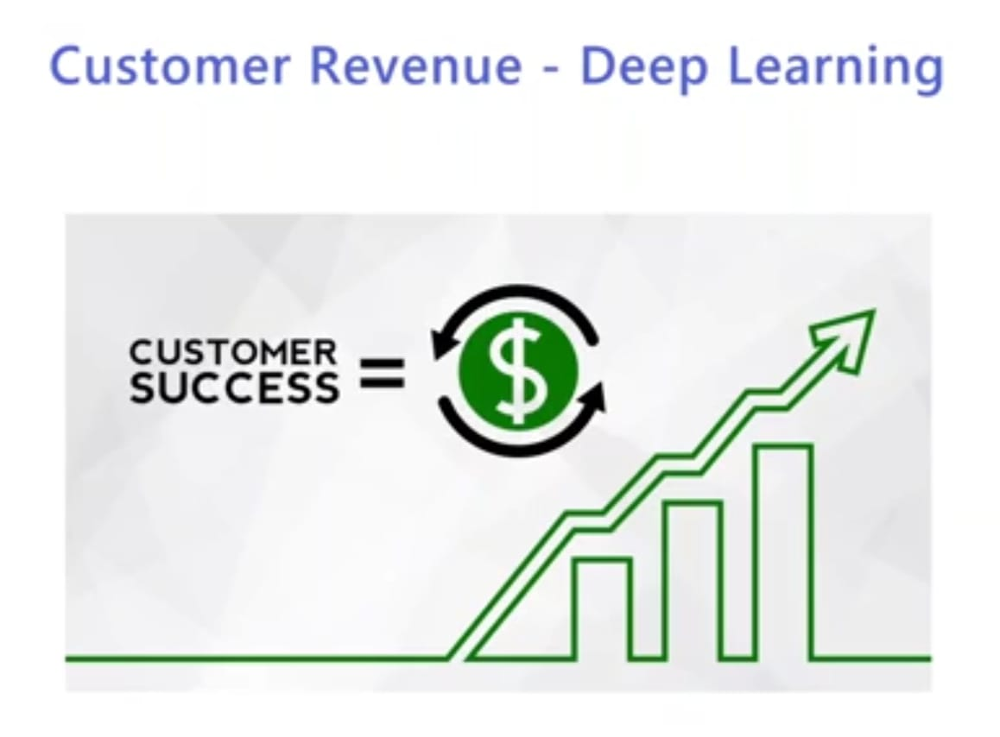

  
 

<h3> Link- https://customer-revenue-predictn-app.herokuapp.com/ </h3>

 <i> <h2>  What is Customer Revenue </h2>

<h3><i> Customers are the backbone of any modern business. They can lead your business to the greater heights if you know how to leverage their participation Customers invest in your services and products at various stages of their customer journey which then are called Customer Revenue These revenue can be in the form of one-time sales or the recurring revenue. </h2>

 

<h2> Details of the Project

<h3> The Project is divided into three parts
<h3>1- Building a Deep learning model to predict customer purchase completion
<h3>2. We build a web app on Django to mount the prediction model. 
<h3>3. We deploy the Django project on Heroku through github.

     
  
 
<h2>Deep Learning Model

<h3> So we start off with building a Deep learning model, a Sequential model with 3 hidden layers and train that model using the customer meta data datapoints </h3>
    
  
  <h2>Deploying on Heroku

<h3> This is the last part of the course where we will deploy the Django application on Heroku using the connections to github. </h3>
    

 

     
  
  <h1> Screenshots </h1>
  <h2> Input Screen </h2>
 
   
  
    
  
<h2> Output Screen </h2> 

   
  
    

### Give It a Star if you liked the project 
